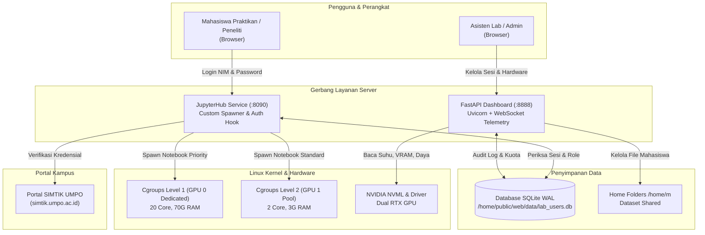

# Buku Panduan Resmi Sistem Komputasi & JupyterHub
## Laboratorium Artificial Intelligence & Riset Komputasi
**Program Studi Informatika — Fakultas Teknik — Universitas Muhammadiyah Ponorogo (UMPO)**

---

* **Judul Dokumen:** Panduan Arsitektur, Konfigurasi, Operasional, & Penggunaan Sistem
* **Edisi:** Versi 2.1 (Produksi) — Oktober 2026
* **Penulis / Tim Pengembang:** Tim Asisten Laboratorium & Pengembang Sistem Komputasi AI UMPO
* **Repositori Kode Sumber:** `https://github.com/PrasetyaRiski/Dashboard_workstation_LAB-UMPO.git`

---

## Daftar Isi Ringkas

1. **Tentang Platform Komputasi Lab AI UMPO**
2. **BAGIAN I: PANDUAN ADMINISTRATOR & ASISTEN LAB (TECHNICAL MANUAL)**
   * Bab 1: Arsitektur Sistem, Topologi, & Alur Komunikasi
   * Bab 2: Konfigurasi Layanan Server & Dynamic QoS
   * Bab 3: Pengoperasian Web Dashboard (Precision Console)
   * Bab 4: Pemeliharaan, Keamanan, & Troubleshooting
3. **BAGIAN II: PANDUAN PENGGUNA (MAHASISWA & PENELITI)**
   * Bab 5: Panduan Memulai Cepat (Quickstart Login SIMTIK)
   * Bab 6: Lingkungan Komputasi AI, PyTorch, & Manajemen Kuota Disk
   * Bab 7: Mode Prioritas Riset & Pengajuan GPU Boost Skripsi
   * Bab 8: Kebijakan Operasional, Single-Device Lock, & Etika Komputasi

---

# Tentang Platform Komputasi Lab AI UMPO

Platform ini mentransformasikan workstation server fisik di Laboratorium AI Fakultas Teknik UMPO menjadi **Private Cloud Computing Cluster** yang cerdas, aman, dan efisien. Sistem ini menggabungkan:
1. **SSO SIMTIK UMPO (*Zero-Admin Onboarding*):** Mahasiswa masuk tanpa perlu registrasi manual; akun diverifikasi langsung ke portal akademik universitas.
2. **Dynamic QoS (Cgroups v2):** Pembagian alokasi komputasi 2-Tier (Standard Praktikum vs Priority Skripsi) yang menjamin server tidak pernah *hang* atau *freeze*.
3. **Web Management Console (Stitch Precision Console):** Panel monitoring beban GPU secara *real-time*, manajemen sesi notebook, alokasi kapasitas (*admission control*), dan eksplorasi berkas mahasiswa (*Admin File Explorer*).
4. **Data Safety & Single-Session Lock:** Pencadangan database otomatis (*hot-backup WAL*) dan perlindungan terhadap *joki praktikum* serta korupsi notebook.

---

# BAGIAN I: PANDUAN ADMINISTRATOR & ASISTEN LAB

---

## Bab 1: Arsitektur Sistem, Topologi, & Alur Komunikasi

### 1.1. Topologi Jaringan & Pemetaan Port

Server workstation terhubung ke jaringan kampus dan tunnel jarak jauh dengan alokasi port utama:

| Port | Layanan | Deskripsi | Akses |
|---|---|---|---|
| **`8888`** | **FastAPI Dashboard Console** | Antarmuka monitoring, kontrol sesi, telemetri WebSocket, dan File Explorer | Aslab & Admin |
| **`8090`** | **JupyterHub Portal** | Pintu gerbang login mahasiswa praktikan dan lingkungan notebook interaktif | Publik / Mahasiswa |
| **`5432`** | **PostgreSQL (Opsional)** | Backend database relasional (fallback otomatis ke SQLite WAL lokal) | Internal Server |
| **`22`** | **OpenSSH Server** | Akses terminal konsol administratif server | Khusus Sysadmin |

### 1.2. Alur Kerja Sistem Terintegrasi



### 1.3. Mekanisme Otentikasi Terbalik (*Reverse Auth*) SIMTIK UMPO
* Modul [`simtik_auth.py`](file:///home/kiki/panel-lab%20%282%29/backend/app/simtik_auth.py) melakukan simulasi jabat tangan terenkripsi (*TLS handshake*) ke portal `https://simtik.umpo.ac.id/apps/action/login.user.php`.
* Jika portal SIMTIK mengonfirmasi kecocokan NIM dan sandi, JupyterHub otomatis membuat akun lokal Unix (`m<NIM>`) dan folder `/home/m<NIM>` dengan hak akses `0700`.
* **Privasi:** Password mahasiswa **tidak pernah disimpan** di penyimpanan lokal server lab.

---

## Bab 2: Konfigurasi Layanan Server & Dynamic QoS

### 2.1. File Konfigurasi Lingkungan (`.env`)
Berkas konfigurasi terletak di direktori root backend (`/home/public/web/panel-lab/backend/.env`):

```bash
# PIN Master Super Admin Dashboard
ADMIN_PIN=labrisetai26

# Lokasi Berkas Database Bersama (Digunakan oleh Dashboard dan JupyterHub)
LAB_DB_PATH=/home/public/web/data/lab_users.db

# Database PostgreSQL (Opsional, jika tidak diset otomatis memakai SQLite WAL)
POSTGRES_HOST=127.0.0.1
POSTGRES_PORT=5432
POSTGRES_USER=postgres
POSTGRES_PASSWORD=postgres
POSTGRES_DB=lab_ai_umpo
```

> [!IMPORTANT]
> Pastikan variabel `LAB_DB_PATH` mengarah ke direktori yang dapat dibaca dan ditulis oleh user `jupyterhub` maupun user eksekusi dashboard FastAPI. Format SQLite menggunakan mode **WAL (Write-Ahead Logging)** untuk menjamin konkurensi data.

### 2.2. Matriks Alokasi Sumber Daya (*Dynamic QoS Slices*)

Server membagi hardware menjadi 2 tingkat alokasi menggunakan **Linux Cgroups v2**:

| Parameter Spesifikasi | Mode Standard (Praktikum) | Mode Prioritas (Skripsi & Riset) |
|---|---|---|
| **Target Pengguna** | Mahasiswa praktikum reguler & akun `training1`-`10` | Mahasiswa Skripsi (di-boost) & akun `labriset` |
| **Alokasi GPU** | **GPU 1** (Shared Compute Pool) | **GPU 0** (Dedicated 100% Khusus Riset) |
| **Batas Memori RAM** | **3 GB** (`MemoryMax=3G`) | **70 GB** (`MemoryMax=70G`) |
| **Batas Kuota CPU** | **2 Core** (`CPUQuota=200%`) | **20 Core** (`CPUQuota=2000%`) |
| **Batas Thread Library** | `OMP_NUM_THREADS=2`, `OPENBLAS=2` | `OMP_NUM_THREADS=20`, `OPENBLAS=20` |
| **Kuota Penyimpanan** | **10 GB** (Soft Quota) | **50 GB** (Soft Quota) |
| **Masa Berlaku Kuota** | Permanen selama masa studi | **1 – 24 Jam** (Auto-expire mundur otomatis) |

### 2.3. Konfigurasi JupyterHub (`/opt/jupyterhub/etc/jupyterhub_config.py`)

Kutipan konfigurasi penting yang dipasang oleh `simtik.sh`:
* **Spawner Hook:** Mengarahkan lingkungan ke cgroup slice yang sesuai (`compute-level1.slice` jika `is_priority=1`, atau `compute-level2.slice` jika standar).
* **Single-Device Session Policy:** Memeriksa apakah `jupyter-m<NIM>-singleuser.service` sedang aktif di IP lain. Jika aktif, login di perangkat baru ditolak (HTTP 403) untuk mencegah bentrok penulisan file dan joki praktikum.
* **Idle Culler:** Menjalankan pembersihan otomatis notebook yang tidak aktif selama 60 menit (`--timeout=3600`).

---

## Bab 3: Pengoperasian Web Dashboard (Precision Console)

### 3.1. Hak Akses Tiga Tingkat (Role-Based Access Control)
1. **Public Monitoring View (Mahasiswa / Tamu):**
   * Mode *read-only*. Dapat melihat grafik utilisasi GPU/CPU/RAM dan antrean aktivitas tanpa tombol tindakan modifikasi.
2. **Operator Mode (Asisten Lab / Aslab):**
   * Login menggunakan NIM & Password SIMTIK (akun bertipe `role: aslab`).
   * Berwenang: Membersihkan disk cache mahasiswa, menghentikan sesi OS mahasiswa yang bermasalah (*Kill Sesi OS Aktif*), memicu backup database.
3. **Super Admin Mode:**
   * Login menggunakan **PIN Master** atau akun NIM bertipe `role: admin`.
   * Berwenang penuh: Memberikan GPU Boost Level 1, mengubah peran akun (Mahasiswa/Aslab/Admin), memblokir/mengaktifkan akun, serta mengelola berkas melalui *Admin File Explorer*.

### 3.2. Prosedur Pemberian GPU Boost (Admission Control)
1. Buka Tab **Pengguna** di Dashboard.
2. Cari NIM mahasiswa skripsi yang mengajukan riset.
3. Klik ikon petir (**⚡ Boost**).
4. Pilih durasi komputasi yang diizinkan (misal: 4 Jam atau 8 Jam).
5. Sistem memeriksa kapasitas: Jika slot GPU 0 sedang penuh (1/1 terpakai), tombol boost dicegah agar GPU tidak oversubscribed.
6. Begitu boost aktif, sesi lama mahasiswa dihentikan sejenak; spawn berikutnya otomatis dialokasikan ke **GPU 0 + 20 Core CPU + 70 GB RAM**. Hitung mundur otomatis berjalan di tabel dashboard.

### 3.3. Mengoperasikan Admin File Explorer
Tersedia menu **File Explorer** mandiri di navigasi sidebar:
* **Pemilihan Direktori Pengguna:** Panel kiri menampilkan daftar mahasiswa aktif dan folder dataset bersama (`dataset_shared`).
* **Navigasi Berkas:** Klik dua kali pada folder untuk masuk, tombol panah atas untuk kembali ke folder induk.
* **Unggah Berkas (Upload):** Klik tombol *Upload File* untuk mengirim berkas dataset/notebook langsung ke home mahasiswa.
* **Unduh & Salin ke Shared:** Admin dapat mengunduh berkas mahasiswa atau menyalinnya ke `/home/dataset_shared/` untuk keperluan praktikum kelas.
* **Operasi Hapus & Ganti Nama:** Dilengkapi konfirmasi aman agar terhindar dari salah klik.

---

## Bab 4: Pemeliharaan, Keamanan, & Troubleshooting

### 4.1. Alur Pembaruan Kode Otomatis (`simtik.sh`)
Untuk menerapkan perbaikan terbaru dari repositori GitHub ke server produksi:

```bash
# Jalankan skrip pembaharuan otomatis sebagai root
sudo bash simtik.sh
```

Skrip ini akan secara otomatis:
1. Menarik commit terbaru dari branch `main` GitHub.
2. Mengompilasi frontend React Vite menjadi asset statis di `frontend/dist/`.
3. Memperbarui dependensi Python di virtual environment (`python-multipart`, `psutil`, dll.).
4. Memeriksa konfigurasi Cgroups v2 dan perizinan mode GPU NVIDIA.
5. Memulai ulang layanan FastAPI Dashboard (`nohup` pada port `8888`) dan `jupyterhub.service`.

### 4.2. Panduan Mengatasi Kendala (Troubleshooting FAQ)

#### Kasus A: "Port 8888 belum merespons / Connection Refused"
* **Penyebab:** Python FastAPI mengalami crash saat startup (misal: dependensi paket belum terinstall atau berkas database terkunci).
* **Solusi:**
  ```bash
  # Periksa isi log backend
  tail -n 50 /home/public/web/panel-lab/backend/dashboard.log

  # Tes jalankan manual untuk melihat traceback error:
  cd /home/public/web/panel-lab/backend
  ../venv/bin/uvicorn app.main:app --host 0.0.0.0 --port 8888
  ```

#### Kasus B: GPU Out-of-Memory (OOM) atau Server Lambat
* **Penyebab:** Mahasiswa memuat model LLM / Vision yang melebihi kapasitas VRAM atau CPU RAM.
* **Solusi:**
  1. Buka Tab **Ringkasan** dan Tab **Pengguna** di Dashboard.
  2. Urutkan berdasarkan kolom **VRAM (MB)** atau **RAM (MB)**.
  3. Klik ikon stop (**Kill Sesi OS Aktif**) untuk membersihkan seluruh proses pengguna tersebut.
  4. Sesi kernel Linux mahasiswa bersangkutan akan dilepas tanpa memengaruhi kestabilan kernel server.

#### Kasus C: Kuota Disk Penuh (`⚠️ Over Quota`)
* **Penyebab:** Folder cache PIP (`~/.cache/pip`) atau checkpoint model PyTorch menumpuk di home direktori.
* **Solusi:**
  1. Klik ikon penghapus (**Bersihkan Cache Disk**) pada baris mahasiswa bersangkutan di Dashboard.
  2. Sistem otomatis mengeksekusi penghapusan `~/.cache/pip` dan `.ipynb_checkpoints` secara aman.

### 4.3. Prosedur Pemulihan Database (*Restore Backup*)
Database dicadangkan otomatis setiap hari pukul 02:00 WIB ke `/home/public/web/data/backups/`.
Jika terjadi kerusakan database:

```bash
# 1. Hentikan sementara layanan
sudo systemctl stop jupyterhub
pkill -f "uvicorn.*8888"

# 2. Salin snapshot cadangan terbaru menggantikan database aktif
cp /home/public/web/data/backups/lab_users_backup_YYYYMMDD_HHMMSS.db /home/public/web/data/lab_users.db
chmod 664 /home/public/web/data/lab_users.db

# 3. Jalankan kembali layanan
sudo systemctl start jupyterhub
cd /home/public/web/panel-lab/backend && nohup ../venv/bin/uvicorn app.main:app --host 0.0.0.0 --port 8888 > dashboard.log 2>&1 &
```

---

# BAGIAN II: PANDUAN PENGGUNA (MAHASISWA & PENELITI)

---

## Bab 5: Panduan Memulai Cepat (Quickstart Mahasiswa)

### 5.1. Alamat Akses Laboratorium
Mahasiswa dapat mengakses portal komputasi interaktif melalui web browser di:
* **JupyterHub Lab:** `http://76.76.76.188:8090` *(atau via domain tunnel kampus)*
* **Dashboard Monitoring Publik:** `http://76.76.76.188:8888`

### 5.2. Cara Masuk (Login)
1. Buka tautan JupyterHub di browser Anda.
2. Masukkan **NIM** Anda pada kolom *Username*.
3. Masukkan **Password Akun SIMTIK UMPO** Anda pada kolom *Password*.
4. Klik tombol **Sign In**.
5. Server akan memvalidasi akun Anda ke sistem kampus secara instan. Direktori kerja pribadi Anda (`/home/m<NIM>`) akan disiapkan dalam hitungan detik.

> [!NOTE]
> Anda tidak perlu mendaftar akun baru ke petugas lab. Selama akun SIMTIK Anda aktif sebagai mahasiswa Universitas Muhammadiyah Ponorogo, Anda langsung memiliki hak akses komputasi lab.

---

## Bab 6: Lingkungan Komputasi AI, PyTorch, & Manajemen Kuota Disk

### 6.1. Menggunakan Akselerator GPU di Python (PyTorch)
Setiap sesi mahasiswa terhubung ke kartu grafis NVIDIA RTX. Untuk memverifikasi dan menggunakan GPU di notebook Anda:

```python
import torch

# Memeriksa ketersediaan GPU
if torch.cuda.is_available():
    print(f"✅ GPU Terdeteksi: {torch.cuda.get_device_name(0)}")
    device = torch.device("cuda:0")
else:
    print("⚠️ Berjalan pada mode CPU")
    device = torch.device("cpu")

# Contoh memindahkan model/tensor ke GPU
x = torch.randn(1000, 1000, device=device)
print(f"Alokasi Memori VRAM Saat Ini: {torch.cuda.memory_allocated() / 1e6:.2f} MB")
```

### 6.2. Menginstal Pustaka (Library) Tambahan
Gunakan opsi `--user` agar paket Python terpasang ke direktori pribadi Anda:

```bash
# Jalankan di Terminal Jupyter atau cell notebook dengan tanda seru (!)
pip install --user scikit-learn seaborn transformers
```

### 6.3. Mematuhi Kuota Penyimpanan (Maksimal 10 GB)
* Setiap mahasiswa diberikan kuota penyimpanan sebesar **10 GB**.
* Jika kapasitas terpakai melebihi 10 GB, status akun Anda di dashboard akan bertanda kuning/merah **Over Quota**.
* **Cara Membersihkan File Sampah Mandiri:**
  ```bash
  # Hapus cache download library PIP yang tidak terpakai
  rm -rf ~/.cache/pip
  
  # Hapus berkas checkpoint notebook otomatis
  find ~ -name ".ipynb_checkpoints" -type d -exec rm -rf {} +
  ```

---

## Bab 7: Mode Prioritas Riset & Pengajuan GPU Boost Skripsi

### 7.1. Fasilitas Mode Prioritas Level 1
Bagi mahasiswa yang sedang menempuh mata kuliah **Tugas Akhir / Skripsi** dengan beban komputasi *Deep Learning* berat (misalnya pelatihan model YOLO, CNN, Transformer berukuran besar), Laboratorium AI UMPO menyediakan alokasi **Priority Tier (Level 1)**:
* **GPU 0 Dedicated:** Akses kartu grafis mandiri tanpa berbagi antrean dengan praktikan lain.
* **20 Core CPU vCPU & 70 GB RAM:** Mencegah notebook mengalami *Kernel Died / Out of Memory*.
* **50 GB Kuota Disk:** Kapasitas lebih lega untuk menyimpan dataset gambar/suara berukuran besar.

### 7.2. Prosedur Mengajukan GPU Boost
1. Hubungi Asisten Laboratorium atau Dosen Pembimbing Riset Anda.
2. Sampaikan NIM, judul penelitian, dan estimasi waktu komputasi yang dibutuhkan (misal: 4 jam atau 8 jam).
3. Aslab akan mengaktifkan slot prioritas Anda melalui Dashboard Admin.
4. Begitu disetujui, buka kembali notebook Anda; beban komputasi otomatis berjalan di atas hardware Level 1.

---

## Bab 8: Kebijakan Operasional, Single-Device Lock, & Etika Komputasi

### 8.1. Kebijakan Kunci Sesi Tunggal (*Single-Device Policy*)
* Akun Anda hanya boleh dibuka pada **1 perangkat dalam satu waktu**.
* Jika Anda membuka sesi di Laptop A lalu mencoba login di Laptop B, sistem secara otomatis menolak login di Laptop B:
  > *"Akses Ditolak: Akun sedang aktif digunakan di perangkat lain. Silakan logout dari perangkat sebelumnya."*
* **Tujuan:** Mencegah kerusakan data akibat penulisan berkas notebook secara bersamaan, serta mencegah praktik *joki komputasi*.
* Jika Anda berpindah perangkat, pastikan selalu menekan tombol **File -> Log Out** pada antarmuka JupyterLab di perangkat lama Anda.

### 8.2. Kebijakan *Idle-Timeout* (Pemadaman Otomatis)
* Server dilengkapi sistem *Idle Culler*.
* Jika notebook Anda tidak menjalankan kalkulasi dan tidak ada interaksi di browser selama **60 menit**, server notebook Anda akan dimatikan otomatis untuk membebaskan VRAM bagi rekan praktikan lain.
* Berkas pekerjaan Anda tetap tersimpan aman di direktori home Anda.

### 8.3. Etika Komputasi Bersama
1. **Dilarang Menambang Kripto (*Cryptomining*):** Aktivitas penambangan koin atau komputasi non-akademik akan dideteksi oleh sistem audit dan akun akan diblokir permanen.
2. **Dataset Bersama:** Manfaatkan folder `/home/dataset_shared/` untuk membaca dataset standar praktikum tanpa perlu mendownload ulang dataset yang sama berkali-kali ke folder pribadi Anda.
3. **Pembersihan Berkas Temporer:** Hapus file checkpoint bobot model (*weights*) yang sudah tidak terpakai agar server tetap bersih dan responsif.

---

## Lembar Pengesahan & Kontak Laboratorium

Dokumen ini disusun untuk menjamin kelancaran praktikum, penelitian, dan kegiatan akademik di Laboratorium Artificial Intelligence Fakultas Teknik Universitas Muhammadiyah Ponorogo.

* **Alamat Laboratorium:** Laboratorium Komputasi AI, Gedung Fakultas Teknik, Universitas Muhammadiyah Ponorogo.
* **Email Dukungan Teknis:** `lab.ai@umpo.ac.id` / Hubungi Asisten Laboratorium yang bertugas.
* **Status Dokumen:** Terverifikasi & Diterapkan pada Sistem Produksi (Oktober 2026).
