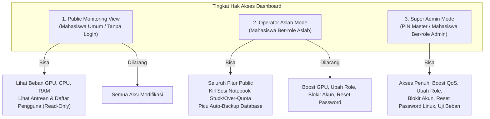

# Dokumen Spesifikasi & Cara Kerja Sistem
## Manajemen Komputasi, Dynamic QoS, & Telemetri Lab AI UMPO
**Platform Terintegrasi: Single Sign-On SIMTIK UMPO, JupyterHub, Cgroups v2, dan Dashboard Monitoring**

* **Versi Dokumen:** 2.0 (Edisi Lengkap Terbaru)
* **Tanggal Rilis:** Oktober 2026
* **Status Implementasi:** Selesai & Production-Ready (Branch `main`)
* **Repositori:** `https://github.com/PrasetyaRiski/Dashboard_workstation_LAB-UMPO.git`

---

## 1. Ringkasan Eksekutif

Sistem ini mentransformasi server workstation fisik di Laboratorium AI Program Studi Informatika Universitas Muhammadiyah Ponorogo (UMPO) menjadi sebuah **Private Cloud AI Platform** yang aman, adil, terisolasi, dan mudah dikelola tanpa beban administrasi manual.

```
┌────────────────────────────────────────────────────────────────────────┐
│                        4 PILAR UTAMA SISTEM                            │
├────────────────────────────────────────────────────────────────────────┤
│ 1. SSO SIMTIK UMPO         : Login instan pakai NIM (Zero Admin)       │
│ 2. Dynamic QoS (Cgroups v2): Proteksi hardware, anti-crash, 2-Tier     │
│ 3. Precision Web Dashboard : UI Stitch modern, RBAC 3-Level, Telemetri │
│ 4. Storage & Data Safety   : Soft quota 10GB/50GB & Auto-backup hot WAL│
└────────────────────────────────────────────────────────────────────────┘
```

---

## 2. Arsitektur Sistem & Alur Komunikasi

Arsitektur sistem dibangun di atas arsitektur modular yang memisahkan antara lapisan autentikasi, orkestrasi resource kernel Linux, telemetri hardware, dan antarmuka web.

```mermaid
flowchart TB
    subgraph Klien["Klien & Pengguna"]
        MHS["Mahasiswa Praktikan / Skripsi<br/>(Browser: Notebook)"]
        ASLAB["Asisten Lab & Super Admin<br/>(Browser: Web Console)"]
    end

    subgraph Gateway["Layanan Akses Server (76.76.76.188)"]
        JH["JupyterHub (:8090)<br/>Custom Authenticator & Spawner"]
        DASH["FastAPI Dashboard (:8888)<br/>Uvicorn + WebSockets Telemetry"]
    end

    subgraph AuthPortal["Portal Kampus Eksternal"]
        SIMTIK["Portal SIMTIK UMPO<br/>(simtik.umpo.ac.id)"]
    end

    subgraph OSKernel["Kernel Linux & Cgroups v2"]
        PAM["Linux PAM Auth<br/>(Akun training1-10, labriset)"]
        L1["compute-level1.slice<br/>(Dedicated GPU 0, 20 Core, 70GB)"]
        L2["compute-level2.slice<br/>(Shared GPU 1, 2 Core, 3GB)"]
        NVML["NVIDIA Driver & NVML<br/>(RTX 3090 / A-Series)"]
    end

    subgraph DataStore["Penyimpanan & Backup"]
        DB[("SQLite WAL: lab_users.db<br/>(/home/public/web/data/)")]
        BKP[("Hot-Backup Directory<br/>(/data/backups/ 14 Hari Retensi)")]
        DISK["Home Folders /home/m<NIM><br/>(Soft Quota Monitor)"]
    end

    MHS -->|HTTP :8090| JH
    ASLAB -->|HTTP :8888| DASH

    JH -->|Verifikasi NIM| SIMTIK
    JH -->|Verifikasi Akun Lokal| PAM
    JH <-->|Validasi Role & Sesi| DB
    JH -->|Spawn Sesi Prioritas| L1
    JH -->|Spawn Sesi Standar| L2

    DASH <-->|Baca/Tulis Status & Audit| DB
    DASH -->|Streaming Metrik GPU/CPU| NVML
    DASH -->|Hitung Kapasitas Folder (du)| DISK
    DASH -.->|Hot Backup Harian| BKP
    DASH -.->|Terminate/Boost Sesi| OSKernel
```

---

## 3. Matriks Hak Akses & Alokasi Hardware (Dynamic QoS)

Resource server dialokasikan secara adil dan terisolasi menggunakan **Linux Cgroups v2** dan **systemd slice**. Tidak ada pengguna yang dapat memonopoli CPU atau RAM hingga menyebabkan server *freeze/hang*.

| Parameter | Standard Tier (Default Mahasiswa) | Priority Tier (Riset & Boost) |
|---|---|---|
| **Sasaran Pengguna** | Mahasiswa praktikum reguler & akun kelas `training1`–`training10` | Mahasiswa Skripsi/Riset yang di-boost admin & akun `labriset` |
| **Alokasi CPU** | **2 Core** (`CPUQuota=200%`) | **20 Core** (`CPUQuota=2000%`) |
| **Batas RAM** | **3 GB** (`MemoryMax=3G`) | **70 GB** (`MemoryMax=70G`) |
| **Alokasi GPU** | **GPU 1 (Shared Pool)** | **GPU 0 (Dedicated)** |
| **Cgroup Slice** | `compute-level2.slice` | `compute-level1.slice` |
| **Threading Library** | `OMP_NUM_THREADS=2`, `OPENBLAS_NUM_THREADS=2` | `OMP_NUM_THREADS=20`, `OPENBLAS_NUM_THREADS=20` |
| **Kuota Storage (Disk)**| **10 GB** (Soft Quota) | **50 GB** (Soft Quota) |
| **Masa Berlaku** | Permanen selama masa studi | **1 – 24 Jam** (Timer otomatis kedaluwarsa) |
| **OOM Handling** | Hanya notebook mahasiswa bersangkutan yang mati | Terisolasi di slice level 1 |

---

## 4. Fitur-Fitur Utama Sistem

### 4.1. Single Sign-On (SSO) SIMTIK UMPO & Zero Admin Onboarding
* Mahasiswa tidak perlu registrasi akun baru. Cukup membuka JupyterHub dan login dengan **NIM** dan **Password SIMTIK UMPO**.
* Sistem secara transparan memverifikasi kredensial ke portal kampus `simtik.umpo.ac.id`.
* Direktori home Linux (`/home/m<NIM>`) dan akun OS terbuat otomatis secara *on-the-fly* dengan hak akses aman (`chmod 0700`, tanpa hak `sudo`).
* Password mahasiswa **tidak pernah disimpan** di database lokal lab.

### 4.2. Kebijakan Kunci Sesi Tunggal (Single-Device Session Lock - Opsi 2)
Mencegah penggunaan 1 akun SIMTIK secara bersamaan di banyak perangkat (mencegah joki praktikum dan korupsi berkas notebook):
* Jika mahasiswa sedang memiliki sesi Jupyter yang aktif di Laptop A, lalu mencoba login di Laptop B:
  * Sistem mendeteksi proses notebook aktif melalui 3 lapisan (*JupyterHub Spawner*, *systemd unit `jupyter-m<NIM>.service`*, dan *psutil process table*).
  * Login pada Laptop B **ditolak seketika** (HTTP 403 Forbidden):
    > *"Akses Ditolak: Akun NIM {nim} sedang aktif digunakan di perangkat lain ({active_ip}). Silakan logout dari perangkat sebelumnya."*
* Sesi awal di Laptop A tetap terlindungi dan tidak terputus. Kunci sesi otomatis dilepas saat mahasiswa menekan **Logout** atau di-kill oleh Aslab via Dashboard.

### 4.3. Monitoring Storage & Soft Quota (Opsi A)
Menjaga kapasitas hard disk server agar tidak dipenuhi oleh dataset mahasiswa:
* **Background Worker Cepat (0 ms latency):** Background worker asinkron (`disk_usage_worker`) menghitung kapasitas folder `/home/m<NIM>` setiap 60 detik di thread terpisah. Data disimpan di cache memori sehingga pemanggilan API Dashboard tidak pernah lag.
* **Tampilan Visual:** Tabel dashboard menampilkan penggunaan disk (MB / GB), batas kuota (10GB / 50GB), dan bar persentase dinamis.
* **Badge & Filter Cepat `⚠️ Over Quota`:** Jika pemakaian melebihi kapasitas, muncul badge peringatan merah dan admin dapat menyaring akun yang kelebihan kuota dengan satu klik pada tab filter.

### 4.4. Auto-Backup Database SQLite Bergaransi (WAL-Safe Hot Backup)
Melindungi data registrasi, hak akses, dan catatan audit:
* **Online Hot-Backup:** Menggunakan Python native `sqlite3.backup()` API yang menyalin database saat server aktif tanpa mematikan layanan dan aman dari transaksi konkurensi SQLite WAL mode.
* **Dual-Layer Automation:**
  1. *Lapis 1:* FastAPI Background Worker (`daily_backup_worker`) berjalan otomatis tiap 24 jam.
  2. *Lapis 2:* Linux Crontab terjadwal tiap **pukul 02:00 WIB** dini hari (`backup_db.py`).
* **Manajemen Retensi 14 Hari:** File backup yang lebih tua dari 14 hari dibersihkan otomatis dengan tetap mempertahankan minimal 5 snapshot terbaru di `/home/public/web/data/backups/`.
* **Manual Trigger:** Tersedia script CLI (`python3 backup_db.py`) dan endpoint REST API (`POST /api/admin/backup`).

### 4.5. Admission Control & Auto-Expiring GPU Boost
* **Slot Kapasitas:** Super Admin dapat memberikan boost resource (Priority Level 1) kepada mahasiswa yang sedang mengerjakan skripsi selama 1, 2, 4, 8, 12, atau 24 jam.
* **Anti-Oversubscription:** Dashboard membatasi jumlah boost aktif (misal maks. 1 slot) agar GPU 0 tidak oversubscribed.
* **Timer Hitung Mundur:** Dashboard menampilkan hitung mundur waktu riil (misal `1 Jam 15 Menit tersisa`).
* **Auto-Expire Worker:** Begitu durasi habis, worker backend otomatis menurunkan status akun ke Standard Level 2 dan mencatatnya ke dalam Audit Log.

### 4.6. JupyterHub Idle Culler (Auto-Release VRAM & RAM)
Mencegah pemborosan VRAM GPU akibat mahasiswa yang lupa logout atau meninggalkan laptop dalam keadaan menyala:
* **Deteksi Otomatis:** Service `jupyterhub-idle-culler` memantau aktivitas kernel dan API server setiap 5 menit (`--cull-every=300`).
* **Batas Toleransi (30 Menit):** Jika sebuah server notebook tidak menjalankan eksekusi kode selama **30 menit** (`--timeout=1800`), server single-user tersebut akan otomatis dihentikan.
* **Pelepasan Resource & VRAM:** Penghentian server langsung mematikan proses CUDA di level OS, melepaskan VRAM GPU 1 seketika, dan memicu `simtik_post_stop_hook` untuk melepas kunci sesi (Single-Device Lock) di database.
* **Keamanan Data Mahasiswa:** Idle Culler **tidak pernah menghapus berkas notebook** milik mahasiswa, hanya menonaktifkan proses kernel yang menganggur.

---

## 5. Matriks Peran & Role-Based Access Control (RBAC)

Dashboard Web dilengkapi pemisahan wewenang 3 tingkat untuk keamanan operasional:



| Fitur / Aksi | Public View | Operator Aslab | Super Admin |
|---|:---:|:---:|:---:|
| Pemantauan Telemetri GPU/CPU/RAM | ✅ | ✅ | ✅ |
| Melihat Tabel User & Kuota Storage | ✅ (Read-Only) | ✅ (Read-Only) | ✅ |
| Melihat Audit Logs Aktivitas Lab | ❌ | ✅ | ✅ |
| **Kill Sesi Notebook (Stuck / Over-Quota)** | ❌ | ✅ | ✅ |
| **Memicu Snapshot Backup Database** | ❌ | ✅ | ✅ |
| **Boost QoS ke Dedicated GPU 0 (Level 1)** | ❌ | ❌ | ✅ |
| **Revert QoS kembali ke Level 2** | ❌ | ❌ | ✅ |
| **Ubah Role Pengguna (Mhs / Aslab / Admin)**| ❌ | ❌ | ✅ |
| **Blokir / Buka Blokir Akses Pengguna** | ❌ | ❌ | ✅ |
| **Reset Password Akun Linux (`training`/`labriset`)** | ❌ | ❌ | ✅ |
| **Hapus Akun Pengguna dari Sistem** | ❌ | ❌ | ✅ |

---

## 6. Panduan Pengelolaan Library Python (Environment)

Lingkungan komputasi di Lab AI menerapkan prinsip isolasi tanpa hak `sudo` bagi mahasiswa:

### A. Rekomendasi Admin: "Golden AI Stack" (Terima Beres)
Agar 99% mahasiswa **tidak perlu repot menginstal library** dan siap *coding* layaknya di Google Colab, Admin Lab cukup menjalankan perintah ini **satu kali saja** di terminal server:
```bash
sudo pip install torch torchvision torchaudio tensorflow keras scikit-learn pandas numpy matplotlib seaborn opencv-python nltk jupyterlab
```
*Keuntungan:* Menghemat puluhan GB ruang disk server (karena library hanya diinstal satu kali secara global di level OS) dan mahasiswa langsung bisa `import torch` tanpa setup.

### B. Cara Mahasiswa Menginstal Library Tambahan (Mandiri)
Jika mahasiswa memerlukan library khusus untuk tugasnya:
1. **Lewat Notebook (Paling Mudah):**
   ```python
   !pip install --user nama-library
   ```
   *Library akan otomatis tersimpan di `/home/m<NIM>/.local/` dan terisolasi untuk mahasiswa tersebut.*
2. **Lewat Web Terminal (JupyterLab):**
   Buka menu **Terminal** di Launcher JupyterLab, lalu buat virtual environment khusus jika diperlukan:
   ```bash
   python3 -m venv ~/myenv
   source ~/myenv/bin/activate
   pip install ipykernel scikit-learn
   python3 -m ipykernel install --user --name=myenv --display-name="Python (MyEnv)"
   ```

---

## 7. Direktori Penting & Topologi File Server

| Jalur Direktori / Berkas | Fungsi & Keterangan |
|---|---|
| `/home/public/web/panel-lab/` | Direktori aplikasi utama (Backend FastAPI & Frontend React). |
| `/home/public/web/panel-lab/deploy_simtik.sh` | Skrip instalasi & penerapan otomatis (Auto-Deploy). |
| `/home/public/web/panel-lab/backup_db.py` | Skrip CLI eksekusi auto-backup database. |
| `/home/public/web/data/lab_users.db` | Database SQLite terpusat (WAL Mode) bersama JupyterHub & Dashboard. |
| `/home/public/web/data/backups/` | Folder arsip snapshot auto-backup (retensi 14 hari). |
| `/home/public/web/panel-lab/setup_local_domain.sh` | Skrip instalasi Domain Lokal (mDNS) & Nginx Reverse Proxy. |
| `/home/public/web/panel-lab/nginx/labai_local.conf` | Konfigurasi reverse proxy Nginx untuk Dashboard & JupyterHub. |
| `/opt/jupyterhub/etc/jupyterhub_config.py` | Berkas konfigurasi utama JupyterHub. |
| `/home/public/web/panel-lab/jupyterhub_simtik_auth.py` | Plugin Authenticator SIMTIK & Spawner Dynamic QoS. |
| `/etc/systemd/system/compute-level1.slice` | Konfigurasi slice cgroups Level 1 (Dedicated GPU 0). |
| `/etc/systemd/system/compute-level2.slice` | Konfigurasi slice cgroups Level 2 (Shared GPU 1). |

---

## 8. Panduan Pemeliharaan & Operasional Harian

### 1. Memperbarui Sistem ke Versi Terbaru (Update)
Jika ada pembaruan fitur di repository GitHub, jalankan di server:
```bash
cd /home/public/web/panel-lab
sudo git pull origin main
sudo bash deploy_simtik.sh
```

### 2. Memeriksa Status Layanan
```bash
# Cek Dashboard Telemetri (Port 8888)
sudo ss -tulpn | grep 8888
# Cek JupyterHub (Port 8090)
sudo systemctl status jupyterhub.service
```

### 3. Melakukan Backup Database Manual
```bash
python3 /home/public/web/panel-lab/backup_db.py
```

### 4. Mengatasi Mahasiswa Stuck / Lupa Logout
1. Buka Dashboard Admin: `http://76.76.76.188:8888`
2. Masuk ke tab **Manajemen Akun**.
3. Cari NIM mahasiswa yang bersangkutan, lalu klik tombol merah **Kill Sesi**. Sesi dan proses notebook mahasiswa tersebut akan langsung dihentikan dan kuncinya dilepaskan.

### 5. Mengaktifkan NVIDIA MPS (Multi-Process Service)
Untuk mengoptimalkan penggunaan VRAM pada GPU 1 (Shared Pool) bagi mahasiswa Level 2, sistem telah mendukung konfigurasi NVIDIA MPS.
1. Jalankan skrip setup yang telah disediakan dengan hak akses root:
```bash
sudo bash /home/public/web/panel-lab/setup_mps_gpu1.sh
```
2. Skrip ini akan mengonfigurasi Compute Mode `EXCLUSIVE_PROCESS` dan menjalankan daemon `nvidia-cuda-mps-control`.
3. Mahasiswa Level 2 otomatis akan dibatasi memori VRAM-nya sesuai variabel `CUDA_MPS_PINNED_DEVICE_MEM_LIMIT` (di-set 2GB via JupyterHub Spawner).
